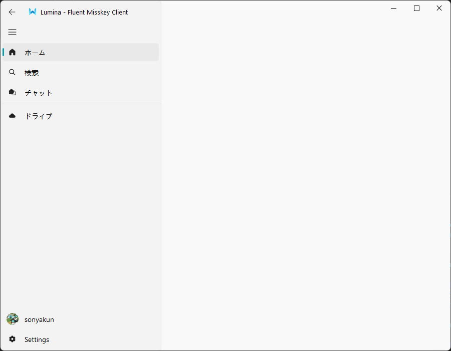

# Lumina
FluentUIを採用したデスクトップ向けのMisskeyクライアントです。

##### これは進行中の作業です。<ins>**現在は利用できません。**</ins>

## todo
[#1](https://github.com/sonyakun/Lumina/issues/1)を参照

## Images

## Thanks
このソフトウェアは以下のライブラリを利用しています。
- [PyQt5](https://pypi.org/project/PyQt5/) by [Riverbank Computing](https://www.riverbankcomputing.com/software/pyqt/)
- [QFluentWidgets](https://github.com/zhiyiYo/PyQt-Fluent-Widgets) by [@zhiyiYo](https://github.com/zhiyiYo)
- [Fluent UI System Icons](https://github.com/microsoft/fluentui-system-icons) by [Microsoft](https://github.com/microsoft/fluentui-system-icons)
- [AiScript.py](https://github.com/sonyakun/AiScript.py) by [@sonyakun](https://github.com/sonyakun)

## License
このソフトウェアは[GNU General Public License 3.0](https://www.gnu.org/licenses/gpl-3.0.ja.html)でライセンスされています。
